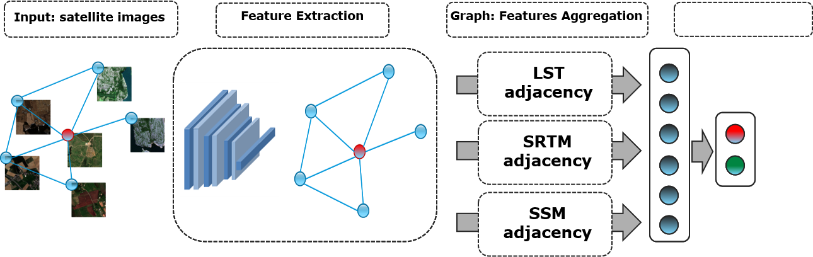

# EGNNA_WND
Pytorch code for estimating the presence of the West Nile Disease employing Graph Neural network. I use the technique proposed in the paper:
**<a href="https://openaccess.thecvf.com/content_CVPR_2019/papers/Gong_Exploiting_Edge_Features_for_Graph_Neural_Networks_CVPR_2019_paper.pdf">Exploiting Edge Features for Graph Neural Networks</a>**.
With these method I am able to exploit not only the node features but also the edge ones, in detail I adopt three different similarity matrices calculated from the temperature (LST), the soil moisture (SSM) and the altitude (SRTM) values.

## Model architecture

## Prerequisites
* Python >= 3.7
* PyTorch >= 1.5
* CUDA 10.0

## Dataset
A Custom Dataset provided by European Space Agency (ESA) is adopted, at the moment I'm not allowed to publish it. I will try to insert a fake version as soon as possible.

## Models
ResNet18 is used as feature extractor, followed by a graph aggregation and a final linear layer. Both the versions based on Graph Attention Network and Graph Convolutional Network are tested.

## Training 
Before running the files ``main.py`` you can set the desired parameters in the file ``job_config.py``, which modify the ones contained in ``config/configuration.json``.

## Cite
If you have any questions, please contact [stefano.vincenzi@unimore.it](mailto:stefano.vincenzi@unimore.it), or open an issue on this repo. 
